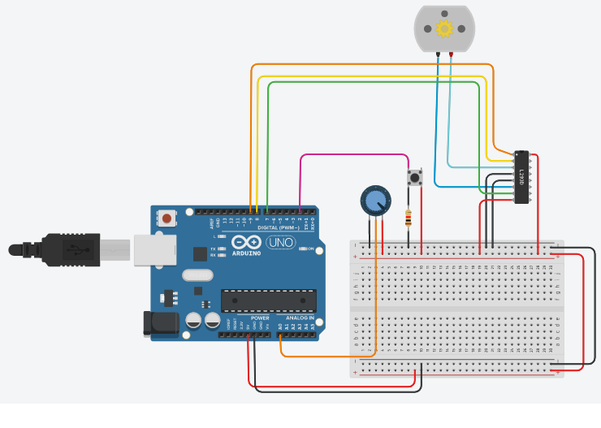
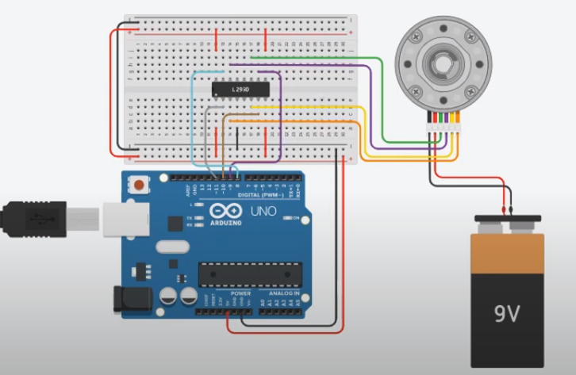
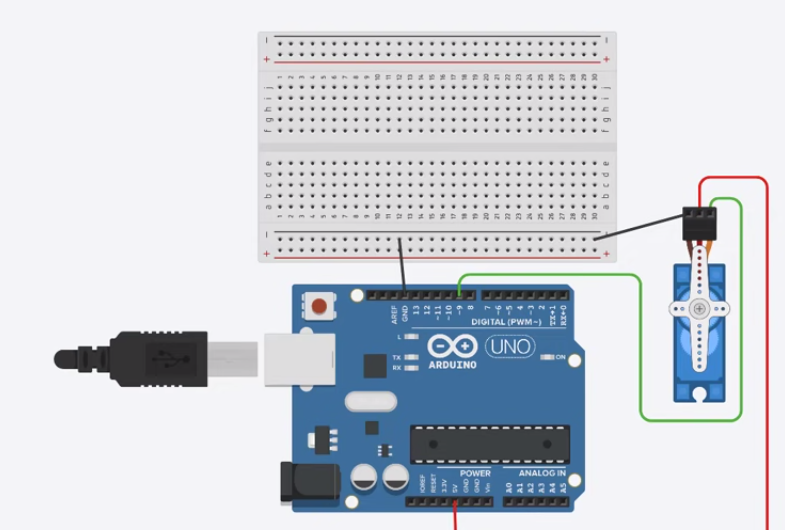

#EE---Task-1
EE Task 1 , 2 & 3: 

1- Brushless motor control system design, including the algorithm and the electronic circuit. 

2 & 3- Connecting the Stepper motor and the Servo motor with the arduino.

## Table of Contents
* [Task 1: Brushless code](#1)
* [Task 2: Stepper Code](#2)
* [Task 3: Servo Code](#3)
* [Participated in the Task](#4)


<a name= "1"></a>
## Brushless Code 
``` c++ 
int buttonState = 0;
int potensio = 0;
int saveData = 0;
int pinA = 7;
int pinB = 8;
int pwm = 9;
void setup()
{
  pinMode(2, INPUT);
  pinMode(7, OUTPUT);
  pinMode(8, OUTPUT);
}
void loop()
{
  buttonState = digitalRead(2);
  if(buttonState == LOW){
    right();
  }
  else{
    left();
  }
  delay(10);
}
void right()
{
  digitalWrite(pinA, LOW);
  digitalWrite(pinB, HIGH);
  saveData = analogRead(potensio);
  analogWrite(pwm, saveData);
  delay(15);
}
  void left()
{
  digitalWrite(pinA, HIGH);
  digitalWrite(pinB, LOW);
  saveData = analogRead(potensio);
  analogWrite(pwm, saveData);
  delay(15);
}
```
### Explanation:
The motor must be supplied by 5V and GND first, initialize pushbutton, potentiometer, saving data, and pin 8 (Connected to pin2 in L293D IC) as an outputs. If the pushbutton is released (Pin 7 is off, Pin 8 is on), the motor rotates in clockwise direction. if the pushbutton is pressed (Pin 7 is on, Pin 8 is off), the motor rotates in counterclockwise direction.

### Brushless Motor simulation



<a name= "2"></a>
## Stepper Code
```c++
#include<Stepper.h> const int stepsPerRevolution = 200; //change this to fit the number //of revolutions for your motor
//initialize the stepper library on pins 8 through 11 Stepper mystepper(stepsPerRevolution, 8, 9, 10, 11); int stepCount = 0; // number of steps the motor has taken void setup() { // nothing to do inside the setup } void loop(){ // read the sensor value: int sensorReading = analogRead(A0); // map it to a range from 0 to 100: int motorSpeed = map(sensorReading, 0, 1023, 0, 250); // set the motor speed: if (motorSpeed > 0){ mystepper.setSpeed(motorSpeed); // step 1/100 of a revolution mystepper.step(stepsPerRevolution/100); } }
```

### Explanation:
First, declare the number of revolutions for the stepper motor then, create a function for stepper motor contains four pins to control the   revolutions of the stepper motor. then set counter that counts the numbee of steps of the stepper motor if the motor speed is greater than 0 which means the motor in the motion phase, the number of steps is executed which are 2 steps = stepsPerRevolution/100 = 200/100=2.

### Stepper Motor simulation



<a name= "3"></a>
## Servo Code

```c++
#include<Servo.h> Servo servoequiv; int pos = 0; void setup() { servoequiv.attach(13); //because I have connected signal pin with 13
}
void loop() { // rotate from 0 to 180 degree for(pos=0;pos<=180;pos++) { servoequiv.write(pos); delay(15); } for(pos=180;pos>=0;pos--); { servoequiv.write(pos); delay(15); } }
```


## Explanation:
The supply of the motor must be connected ( 5V and ground GND) First, Create a funtion to power servo motors after that declare the angle of motors rotation then, give a signal to the motors and this signal is from pin 13 from the arduino uno r3 then do a for loop to control of motor rotation. if the angle of rotation is from 0 to smaller than or equal 180, the motors rotates in counterclockwise direction for 15 millisecond. if the angle of rotation is equal to 180 to greater than or equal to 0, the motors rotates in clockwise for 15 millisecond.

### Servo Motor simulation



<a name= "4"></a>
## Participated in the Task: 
- Abdulwahab Dhifallah [@Elechop](https://github.com/Elechop)
